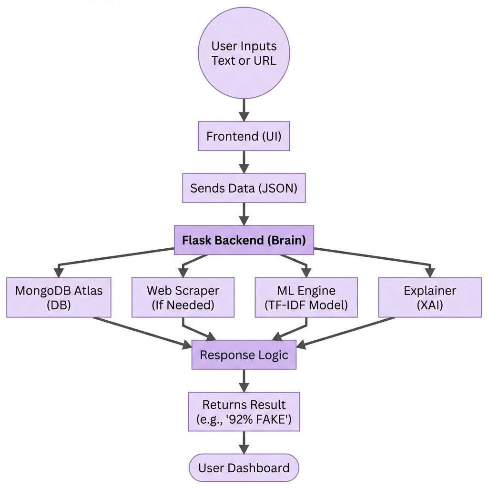

# TruthLens AI: System Architecture & Workflow

## 1. System Architecture Diagram

> [!TIP]
> For a detailed, step-by-step breakdown of the data processing pipeline, see the [Data Flow Diagram](DATA_FLOW.md).

## 2. Architecture Overview

TruthLens AI operates on a modern, monolithic architecture designed for speed and simplicity. It consists of four primary layers:

### A. The User Layer (Client)
*   **User Interface (UI):** A responsive web dashboard featuring a "Bento Grid" layout. It handles user inputs (text/URL) and displays results with visual indicators (colors, icons).
*   **Data Transport:** Communication happens via **JSON** over HTTPS.

### B. The Application Layer (Backend Brain)
*   **Flask Framework:** The central controller. It receives requests, validates authentication (JWT), and routes data to the correct processing engine.
*   **Logic Components:**
    *   **Web Scraper:** An automated module that can visit a URL, strip out ads/menus, and extract the core article text.
    *   **ML Engine:** The core intelligence that uses a trained Logistic Regression model to classify text.
    *   **Explainer (XAI):** A specialized module that "reverse engineers" the model's decision to find which specific words (e.g., "shocking", "breaking") contributed most to the score.

### C. The Data Layer
*   **MongoDB Atlas:** A cloud-based NoSQL database that stores:
    *   **User Profiles:** Login credentials and secure tokens.
    *   **Analysis Logs:** A history of every scan performed, allowing users to review past results.

---

## 3. How It Works (Workflow Step-by-Step)

This corresponds to the vertical flow in the diagram above:

### Step 1: User Input
The user authenticates and enters data into the dashboard. This can be:
*   **Raw Text:** Copied from social media or WhatsApp.
*   **URLs:** Links to news articles.

### Step 2: Data Packaging
The frontend packages this input into a structured **JSON** format and sends a secure POST request to the Flask server.

### Step 3: Central Processing (Flask)
The Flask server acts as the "Brain". It decides the path:
*   **If URL:** It activates the **Web Scraper** to fetch the content first.
*   **If Text:** It passes the content directly to the internal engines.

### Step 4: Parallel Intelligence
The system runs three operations efficiently:
1.  **Vectorization:** Converts the text into mathematical numbers (TF-IDF).
2.  **Prediction:** The **ML Engine** calculates a probability score (e.g., 0.92 for Fake).
3.  **Explanation:** The **XAI Explainer** scans the text to identify high-impact keywords.

### Step 5: Response Logic
A centralized logic handler consolidates all data:
*   Combines the **Prediction** (Fake/Real).
*   Combines the **Confidence Score** (92%).
*   Combines the **Reasoning** (List of suspicious words).
*   *Simultaneously saves this record to MongoDB for history.*

### Step 6: Final Output
The server sends a detailed response back to the user. The Dashboard updates instantly to show the "FAKE" or "REAL" badge along with the confidence bar and explaining keywords.
