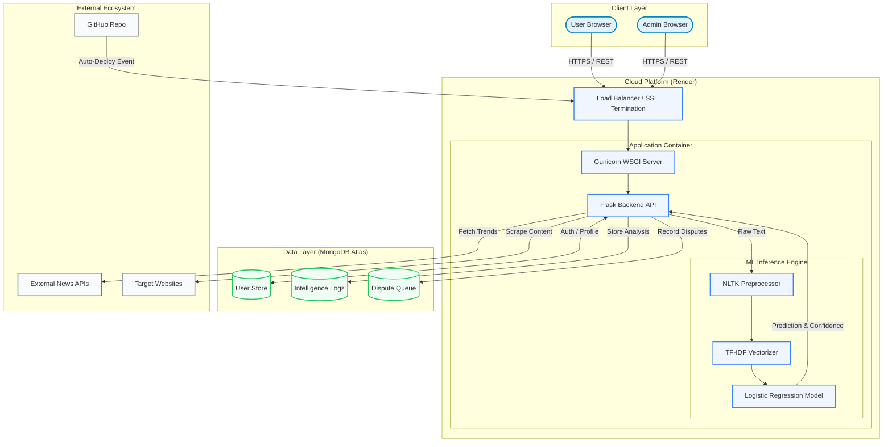

# System Architecture Diagram

```mermaid
graph TD
    %% Nodes
    subgraph "Client Layer"
        User([User Browser])
        Admin([Admin Browser])
    end

    subgraph "Cloud Platform (Render)"
        LB[Load Balancer / SSL Termination]
        
        subgraph "Application Container"
            Gunicorn[Gunicorn WSGI Server]
            Flask[Flask Backend API]
            
            subgraph "ML Inference Engine"
                cleaner[NLTK Preprocessor]
                tfidf[TF-IDF Vectorizer]
                model[Logistic Regression Model]
            end
        end
    end

    subgraph "Data Layer (MongoDB Atlas)"
        Users[(User Store)]
        Logs[(Intelligence Logs)]
        Feedback[(Dispute Queue)]
    end

    subgraph "External Ecosystem"
        GitHub[GitHub Repo]
        NewsAPI[External News APIs]
        Web[Target Websites]
    end

    %% Flows
    User -->|HTTPS / REST| LB
    Admin -->|HTTPS / REST| LB
    LB --> Gunicorn
    Gunicorn --> Flask

    %% Backend Logic
    Flask <-->|Auth / Profile| Users
    Flask -->|Store Analysis| Logs
    Flask -->|Record Disputes| Feedback
    
    %% ML Flow
    Flask -- "Raw Text" --> cleaner
    cleaner --> tfidf
    tfidf --> model
    model -- "Prediction & Confidence" --> Flask

    %% External
    Flask -- "Fetch Trends" --> NewsAPI
    Flask -- "Scrape Content" --> Web
    GitHub -- "Auto-Deploy Event" --> LB

    %% Styling
    classDef client fill:#e0f2fe,stroke:#0284c7,stroke-width:2px;
    classDef cloud fill:#f0f9ff,stroke:#0ea5e9,stroke-width:2px,stroke-dasharray: 5 5;
    classDef app fill:#eff6ff,stroke:#3b82f6,stroke-width:2px;
    classDef db fill:#f0fdf4,stroke:#22c55e,stroke-width:2px;
    classDef ext fill:#f8fafc,stroke:#64748b,stroke-width:2px;

    class User,Admin client;
    class LB,Gunicorn,Flask,cleaner,tfidf,model app;
    class Users,Logs,Feedback db;
    class GitHub,NewsAPI,Web ext;
```
