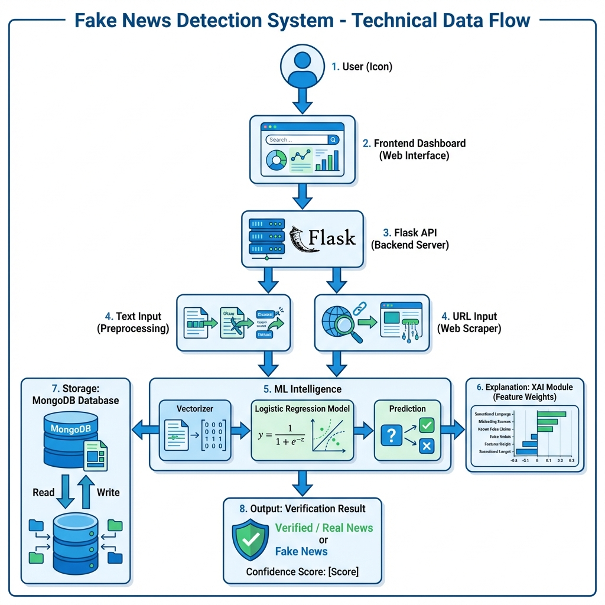

# Data Flow Diagram (DFD) & Explanation

This document details the flow of data within the TruthLens Intelligence system, from user input to the final fake news detection result.

## 1. Visual Overview


## 2. Technical Diagram (Mermaid)

```mermaid
graph TD
    %% Nodes
    User([User])
    Frontend[Frontend Dashboard]
    API[Flask API]
    Auth{Authenticated?}
    Router{Input Type?}
    
    subgraph "Details: Data Processing"
        Clean[Preprocessing Engine<br/>(Regex, Lemmatization)]
        Vector[Vectorization<br/>(TF-IDF)]
    end
    
    subgraph "Details: Intelligence Core"
        Model[ML Model<br/>(Logistic Regression)]
        XAI[XAI Explainer<br/>(Feature Weight Analysis)]
    end
    
    subgraph "External Sources"
        Scraper[Web Scraper]
        RSS[News Feed API]
    end
    
    subgraph "Data Storage"
        DB[(MongoDB Atlas)]
    end

    %% Flows
    User -->|Enters Text/URL| Frontend
    Frontend -->|JSON Request| API
    
    API -->|Verify Token| Auth
    Auth -- No --> Err[Return 401]
    Auth -- Yes --> Router
    
    %% Paths
    Router -- "Text Input" --> Clean
    Router -- "URL Input" --> Scraper
    Router -- "Live Feed" --> RSS
    
    Scraper -->|Extracted Text| Clean
    RSS -->|News Titles| Clean
    
    Clean -->|Cleaned Tokens| Vector
    Vector -->|Feature Vector| Model
    
    Model -->|Prediction & Probabilities| Logic[Logic Controller]
    Vector -->|Vector Data| XAI
    XAI -->|Contributing Words| Logic
    
    Logic -->|Log Results| DB
    Logic -->|JSON Response| Frontend
    Frontend -->|Display Results| User
```

## 2. Detailed Data Flow Explanation

The data flows through the system in **six distinct stages**, ensuring that raw input is transformed into actionable intelligence.

### Step 1: Input Acquisition
The journey begins when the user interacts with the Frontend Dashboard.
*   **Direct Text:** The user pastes a suspicious message directly.
*   **URL:** The user provides a link to a news article.
*   **Live Feed:** The system fetches real-time headlines from external RSS sources (BBC, Reuters).

All inputs are packaged into a structured **JSON** payload and sent to the Flask Backend via HTTPS.

### Step 2: Authentication & Routing
Upon receiving the request, the **Flask API**:
1.  **Validates Identity:** checks for a valid JWT (JSON Web Token) to ensure the user is logged in.
2.  **Routes the Data:**
    *   If **Text**: Sent directly to preprocessing.
    *   If **URL**: Passed to the **Web Scraper**, which fetches the page HTML, strips ads/scripts, and extracts the core body text.

### Step 3: Preprocessing (The Cleaner)
Before analysis, the raw text must be standardized. The **Preprocessing Engine** performs:
*   **Lowercasing:** Converts "FAKE" to "fake".
*   **Noise Removal:** Uses Regex to remove special characters and emojis.
*   **Tokenization & Lemmatization:** Breaks text into words and converts them to their root form (e.g., "running" -> "run") using NLTK.

### Step 4: Intelligence Processing
The cleaned data is processed by two parallel engines:
1.  **Prediction Engine (The Judge):**
    *   **Vectorization:** The text is converted into a numerical format using a loaded `TF-IDF Vectorizer`.
    *   **Classification:** The `Logistic Regression Model` calculates the probability of the text being "FAKE" or "REAL".
2.  **XAI Explainer (The Interpreter):**
    *   It analyzes the vector weights against the model's coefficients.
    *   It identifies which specific words (e.g., "breaking", "shocking", "verified") pushed the score towards Fake or Real.

### Step 5: Decision Logic & Storage
The **Logic Controller** synthesizes the results:
*   **Confidence Calculation:** Converts the model's probability (e.g., 0.95) into a percentage (95%).
*   **Status Assignment:** Assigns a badge based on thresholds (e.g., >90% = "Critical Misinformation" or "True News").
*   **Logging:** The complete interaction (User ID, Text, Result, Timestamp) is saved to **MongoDB** for history and admin review.

### Step 6: Response & Visualization
Finally, the backend sends a comprehensive JSON response back to the frontend. The UI parses this data to:
*   Display the **Prediction Badge** (Red for Fake, Green for Real).
*   Animate the **Confidence Bar**.
*   Show the **"Why?" section** listing the contributing words found by the XAI module.
