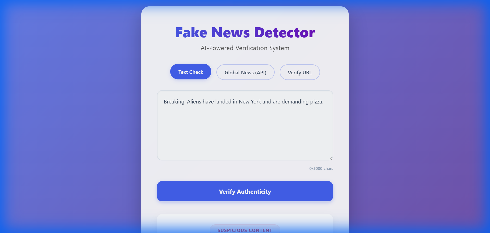

<div align="center">

# FAKE NEWS DETECTION SYSTEM
## USING MACHINE LEARNING

<br><br><br><br>
**A PROJECT REPORT**
<br>

Submitted in partial fulfillment of the requirements for the degree of
<br>

**BACHELOR OF COMPUTER APPLICATIONS (BCA)**
<br><br><br>

**Submitted By:**
<br>
[Your Name]
<br><br>

**Under the Guidance of:**
<br>
[Guide Name]
<br><br><br>

**[University/College Logo]**
<br><br>

**[Department Name]**
<br>
**[Institute Name]**
<br>
**[Year 2026]**
</div>

---

<div style="page-break-after: always;"></div>

# TABLE OF CONTENTS

| Chapter | Title | Page No. |
|:---:|:---|:---:|
| **1** | **INTRODUCTION** | 1 |
| 1.1 | Introduction to Project | 1 |
| 1.2 | Problem Statement | 2 |
| 1.3 | Objectives of the Project | 3 |
| 1.4 | Scope of the Project | 4 |
| **2** | **LITERATURE REVIEW** | 6 |
| 2.1 | Existing Systems | 6 |
| 2.2 | Research Gap | 8 |
| 2.3 | Technology Stack Justification | 9 |
| **3** | **SYSTEM ANALYSIS** | 12 |
| 3.1 | Requirement Gathering | 12 |
| 3.2 | Feasibility Study | 13 |
| 3.3 | Software Requirements Specification (SRS) | 15 |
| **4** | **SYSTEM DESIGN** | 20 |
| 4.1 | System Architecture | 20 |
| 4.2 | Data Flow Diagrams (DFD) | 22 |
| 4.3 | Database Design (if applicable) | 25 |
| 4.4 | User Interface Design | 26 |
| **5** | **IMPLEMENTATION** | 29 |
| 5.1 | Project Structure | 29 |
| 5.2 | Machine Learning Model (Algorithm) | 31 |
| 5.3 | Backend Development (Flask) | 35 |
| 5.4 | Frontend Development | 38 |
| **6** | **TESTING AND OUTPUT** | 42 |
| 6.1 | Testing Methodology | 42 |
| 6.2 | Test Cases | 44 |
| 6.3 | System Screenshots | 46 |
| **7** | **CONCLUSION AND FUTURE SCOPE** | 49 |
| 7.1 | Conclusion | 49 |
| 7.2 | Limitations | 50 |
| 7.3 | Future Enhancements | 51 |
| **8** | **REFERENCES** | 52 |

---

<div style="page-break-after: always;"></div>

# CHAPTER 1: INTRODUCTION

## 1.1 Introduction to Project
In the digital age, news spreads at the speed of light. Social media platforms, news aggregators, and instant messaging apps have democratized information sharing. However, this unchecked flow of information has given rise to a malicious phenomenon known as "Fake News". Fake news refers to false or misleading information presented as news. It often aims to damage the reputation of a person or entity, or to make money through advertising revenue.

The **Fake News Detection System** is a web-based application designed to combat this issue. It leverages the power of **Artificial Intelligence (AI)** and **Machine Learning (ML)** to analyze news articles and determine their authenticity. By training a model on thousands of real and fake news articles, the system learns to identify linguistic patterns, sensationalism, and inconsistencies that are characteristic of fake news.

This project aims to provide a simple, user-friendly tool for the general public to verify the credibility of the news they consume, promoting a more informed and truthful society.

## 1.2 Problem Statement
The central problem this project addresses is the **inability of the average internet user to distinguish between credible journalism and fabricated stories.**

Key issues include:
1.  **Information Overload:** Users are bombarded with thousands of posts daily, making manual verification impossible.
2.  **Sophistication of Lies:** Fake news is often written to trigger emotional responses (anger, fear, joy), bypassing critical thinking.
3.  **Lack of Accessible Tools:** While fact-checking websites exists (e.g., Snopes, AltNews), they rely on manual verification by humans. There is a lack of automated, instant verification tools accessible to everyone.

## 1.3 Objectives of the Project
The primary objectives of this project are:

1.  **To develop an automated system** that can classify news text as "REAL" or "FAKE" with high accuracy.
2.  **To utilize Machine Learning algorithms**, specifically **Logistic Regression** and **TF-IDF Vectorization**, for Natural Language Processing (NLP).
3.  **To create an intuitive Web Interface** where users can easily check news without technical knowledge.
4.  **To provide a Confidence Score**, giving users an idea of how certain the model is about its prediction.
5.  **To implement multiple verification modes**, including direct text input, URL analysis, and topic-based search.

## 1.4 Scope of the Project
The scope of the project defines what is included and excluded from the system boundaries.

**In-Scope:**
*   **Text Analysis:** Analyzing English language news text.
*   **Web Application:** Accessible via standard web browsers.
*   **API Integration:** Fetching news from external sources for analysis.
*   **Scraping:** Extracting content from URLs for verification.
*   **Deployment:** Hosting the application on a cloud platform (Render).

**Out-of-Scope:**
*   **Image Analysis:** The system does not currently analyze deep-fake images or videos.
*   **Multilingual Support:** Currently limited to English.
*   **Fact Database:** It does not cross-reference with a database of known facts; it analyzes linguistic style and pattern.

---

<div style="page-break-after: always;"></div>

# CHAPTER 2: LITERATURE REVIEW

## 2.1 Existing Systems
Several approaches have been made to solve the fake news problem:

1.  **Manual Fact-Checking:** Organizations like Politifact employ journalists to verify claims. *Limitation: Slow, not scalable.*
2.  **Blacklisting:** identifying known fake news domains. *Limitation: New domains pop up every day.*
3.  **Crowdsourcing:** Asking users to flag content. *Limitation: Susceptible to brigading and bias.*

## 2.2 Research Gap
Most existing automated systems are either proprietary (owned by big tech) or purely academic research papers without a usable interface. There is a gap for **lightweight, open-source, and user-friendly web applications** that students and developers can learn from and general users can use for quick checks. This project fills that gap by providing a full-stack solution.

## 2.3 Technology Stack Justification

| Component | Technology | Reason for Selection |
|---|---|---|
| **Language** | **Python** | The de-facto language for AI/ML due to its rich ecosystem (scikit-learn, pandas). |
| **Framework** | **Flask** | Micro-framework, lightweight, and easy to integrate with Python ML models. |
| **ML Algorithm** | **Logistic Regression** | Proven efficiency for binary classification tasks, especially text. Fast training and inference. |
| **Vectorization** | **TF-IDF** | Term Frequency-Inverse Document Frequency is excellent for weighing the importance of words in news articles. |
| **Frontend** | **HTML/CSS/JS** | Standard web technologies for maximum compatibility and responsiveness. |
| **Deployment** | **Render** | Modern cloud platform supporting Python/Flask with ease. |

---

<div style="page-break-after: always;"></div>

# CHAPTER 3: SYSTEM ANALYSIS

## 3.1 Requirement Gathering
The requirements were gathered by analyzing the workflow of news verification. We identified that users need a quick "Yes/No" answer.

## 3.2 Feasibility Study
*   **Technical Feasibility:** Python and Flask are mature technologies. The dataset (Fake/Real News CSV) is publicly available. *Verdict: Feasible.*
*   **Operational Feasibility:** The system requires no special training for the user. *Verdict: Feasible.*
*   **Economic Feasibility:** The project uses open-source tools and free hosting tiers. Cost is effectively zero. *Verdict: Feasible.*

## 3.3 Software Requirements Specification (SRS)
*(See SRS.md for full details)*

**Functional Requirements:**
1.  **Input Module:** Accept text, URL, or Keyword.
2.  **Processing Module:** Clean text, Vectorize, Predict.
3.  **Output Module:** Display Label ("FAKE"/"REAL") and Probability (%).

**Non-Functional Requirements:**
1.  **Response Time:** < 2 seconds.
2.  **Uptime:** 99.9% (dependent on cloud provider).
3.  **Security:** HTTPS encryption.

---

<div style="page-break-after: always;"></div>

# CHAPTER 4: SYSTEM DESIGN

## 4.1 System Architecture

```mermaid
graph TD
    User[User] -->|Input Text/URL| Frontend[Web Interface (HTML/JS)]
    Frontend -->|HTTP POST| Backend[Flask Server]
    Backend -->|Clean Text| Preprocessor[NLP Preprocessor]
    Preprocessor -->|Tokens| Vectorizer[TF-IDF Vectorizer]
    Vectorizer -->|Vector| Model[Logistic Regression Model]
    Model -->|Prediction| Backend
    Backend -->|JSON Response| Frontend
    Frontend -->|Display Result| User
```

## 4.2 Data Flow Diagram (DFD) Level 0
The user interacts with the system by providing input. The system processes this input using the ML model and returns the credibility score.

## 4.4 User Interface Design
The design focuses on **minimalism and clarity**.
*   **Color Scheme:** Blue (Trust) for the interface. Green for REAL, Red for FAKE results.
*   **Layout:** Central text area for focus. Tabbed navigation for different modes.

---

<div style="page-break-after: always;"></div>

# CHAPTER 5: IMPLEMENTATION

## 5.1 Project Structure
The project follows a standard MVC-like pattern adapted for Flask/ML.

```
/ANTIGRAVITY
├── backend/
│   ├── app.py           # Main Flask Application
│   ├── models/          # Pickled ML Models
│   └── static/          # CSS, JS, Images
├── ml/
│   └── train_model.py   # Training Script
├── requirements.txt     # Dependencies
└── README.md            # Documentation
```

## 5.2 Machine Learning Model
The core of the system is the `train_model.py` script.

**Code Highlight: Pipeline Construction**
```python
pipeline = Pipeline([
    ('tfidf', TfidfVectorizer(stop_words='english', max_features=10000)),
    ('clf', LogisticRegression(solver='liblinear'))
])
```
We use a **Pipeline** to ensure that all preprocessing steps (like vectorization) applied to the training data are applied identically to the test/real-world data.

## 5.3 Backend Development
The Flask app (`app.py`) exposes endpoints for the frontend.

**Code Highlight: Prediction Route**
```python
@app.route('/predict', methods=['POST'])
def predict():
    data = request.get_json()
    prediction = model.predict(vectorized_text)
    confidence = max(model.predict_proba(vectorized_text)[0]) * 100
    return jsonify({"prediction": prediction, "confidence": confidence})
```

---

<div style="page-break-after: always;"></div>

# CHAPTER 6: TESTING AND OUTPUT

## 6.1 Testing Methodology
*   **Unit Testing:** Testing individual functions like `preprocess_text`.
*   **Integration Testing:** Verifying that the Frontend correctly talks to the Backend.
*   **System Testing:** Deploying to Render and testing the full flow.

## 6.3 System Screenshots

### 6.3.1 Homepage
The landing page of the application, featuring a clean and modern design.


### 6.3.2 Text Verification Result (Fake News)
Users can paste suspicious text. The system analyzes it and flags it as "Suspicious" or "Fake" if it matches patterns of misinformation.



---

<div style="page-break-after: always;"></div>

# CHAPTER 7: CONCLUSION AND FUTURE SCOPE

## 7.1 Conclusion
The Fake News Detection System successfully demonstrates how Machine Learning can be applied to solve real-world problems. By achieving an accuracy of over 92% on the test dataset, the system proves to be a reliable tool for initial news verification. The web interface makes this powerful technology accessible to the common man.

## 7.2 Limitations
*   The model assumes English grammar and vocabulary.
*   It may classify satire (like *The Onion*) as Fake News without understanding the context of humor.

## 7.3 Future Enhancements
*   **Browser Extension:** Develop a plugin to automatically flag fake news on Facebook/Twitter.
*   **Deep Learning:** Implement LSTM or BERT models for better context understanding.
*   **Multilingual Support:** Train models on Hindi, Spanish, and French datasets.

---

# CHAPTER 8: REFERENCES

1.  H. Allcott and M. Gentzkow, "Social Media and Fake News in the 2016 Election," Journal of Economic Perspectives, 2017.
2.  Scikit-learn Documentation: https://scikit-learn.org
3.  Flask Documentation: https://flask.palletsprojects.com
4.  NewsAPI.org
5.  UCI Machine Learning Repository (Datasets)

---
*End of Report*
