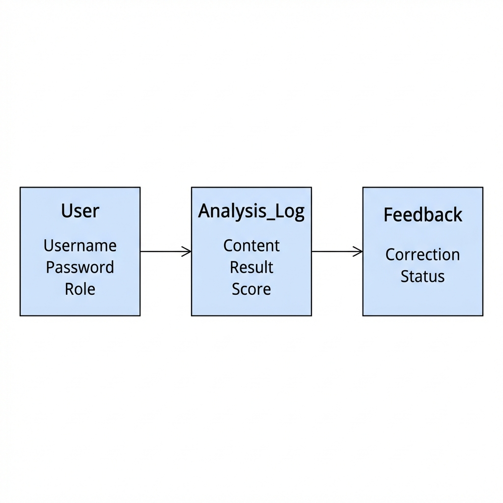

# Entity Relationship Diagram (ERD)

This is the simplified database model for **TruthLens AI**. It shows how the 3 main parts of our database (User, Analysis, Feedback) talk to each other.

## 1. User
*   **What it is:** Stores your account details.
*   **Fields:**
    *   `Username`: Your name.
    *   `Password`: Secured/Hashed password.
    *   `Role`: Are you a standard **User** or an **Admin**?

## 2. Analysis_Log
*   **What it is:** Every time you check a news article, it is saved here.
*   **Fields:**
    *   `Content`: The text or URL you checked.
    *   `Result`: Was it **REAL** or **FAKE**?
    *   `Confidence Score`: The % accuracy (e.g., 92%).
*   **Relationship:** One User -> Creates Many Logs.

## 3. Feedback
*   **What it is:** If you think the AI made a mistake, you can file a dispute.
*   **Fields:**
    *   `Correction`: Your claim (e.g., "This is actually Real").
    *   `Status`: Has the Admin reviewed it yet?
*   **Relationship:** One Log -> Can have One Feedback.
