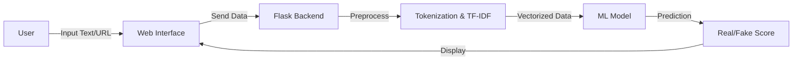

# PROJECT SYNOPSIS
## Fake News Detection System

**Topic:** Fake News Detection Using Machine Learning  
**Date:** 2026-01-23

---

### 1. Introduction
The proliferation of fake news on social media and digital platforms has become a critical global issue, leading to misinformation and panic. This project, **Fake News Detection System**, is an AI-powered web application designed to automatically classify news articles as "REAL" or "FAKE". By utilizing Natural Language Processing (NLP) and Machine Learning (Logistic Regression), the system analyzes the linguistic patterns of text to determine its authenticity.

**System Flowchart:**

### 2. Objective
The primary objectives of this project are:
*   To develop an automated system capable of detecting fake news with high accuracy (>90%).
*   To implement a user-friendly Web Interface for easy access by the general public.
*   To utilize **Logistic Regression** and **TF-IDF** for efficient text classification.
*   To provide a confidence score (probability) along with the prediction.
*   To deploy the solution on a cloud platform (**Render**) for real-time global accessibility.

### 3. Hardware and Software Requirements

**Software Requirements:**
*   **Operating System:** Windows 10/11, Linux, or macOS.
*   **Programming Language:** Python 3.11+.
*   **Web Framework:** Flask.
*   **Libraries:** Scikit-learn, Pandas, NLTK, Gunicorn.
*   **Tools:** VS Code, Git, GitHub.
*   **Cloud Platform:** Render (for deployment).

**Hardware Requirements:**
*   **Processor:** Intel Core i3 or higher / AMD equivalent.
*   **RAM:** Minimum 4GB (8GB recommended for training).
*   **Storage:** 500MB free disk space.
*   **Internet Connection:** Required for API access and deployment.

### 4. Research Gap
Existing solutions for fake news verification typically fall into two categories: manual fact-checking (which is slow and non-scalable) or complex academic models (which lack user interfaces).
*   **The Gap:** There is a lack of lightweight, open-source tools that combine accurate ML classification with a simple, accessible UI for the common user.
*   **Our Solution:** This project bridges that gap by wrapping a powerful ML model in an intuitive web app that anyone can use instantly without technical knowledge.

### 5. Timeline

| Phase | Activity | Duration |
| :--- | :--- | :--- |
| **Phase 1** | Requirement Gathering & Data Collection | Week 1 |
| **Phase 2** | Preprocessing & Model Training | Week 2 |
| **Phase 3** | Backend (Flask) & Frontend Development | Week 3 |
| **Phase 4** | Testing, Validation & UI Polish | Week 4 |
| **Phase 5** | Cloud Deployment (Render) & Documentation | Week 5 |

### 6. Advantages
*   **Automated Verification:** Instant results without human intervention.
*   **High Accuracy:** ~92% accuracy on the test dataset.
*   **User-Friendly:** Simple "Paste & Check" interface.
*   **Scalable:** Hosted on the cloud, accessible from any device.
*   **Cost-Effective:** Built using open-source technologies (Python) and free tier hosting.

### 7. Reference
1.  *H. Allcott and M. Gentzkow*, "Social Media and Fake News in the 2016 Election," Journal of Economic Perspectives, 2017.
2.  *Scikit-learn Documentation*: https://scikit-learn.org
3.  *Flask Documentation*: https://flask.palletsprojects.com
4.  *UCI Machine Learning Repository*: https://archive.ics.uci.edu/ml/datasets.php
