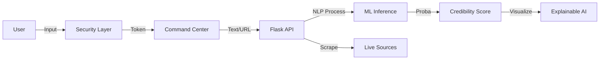

# PROJECT SYNOPSIS
## TruthLens AI - Fake News Detection System

**Topic:** AI-Powered Misinformation Analysis & Verification Platform  
**Version:** 3.0 (Final)  
**Date:** 2026-01-25

---

### 1. Introduction
"TruthLens AI" is an enterprise-grade web application designed to combat the spread of misinformation in the digital age. Unlike basic text classifiers, this system offers a comprehensive integrity verification suite. It combines advanced Machine Learning (Logistic Regression & TF-IDF) with real-time web scraping and global API integration to cross-reference news from multiple sources. The platform features a secured "Command Center" dashboard, allowing authorized agents to investigate text, URLs, and global trends instanttly.

**System Flowchart:**

### 2. Objective
The primary objectives of TruthLens AI are:
*   **Multi-Modal Verification:** To detect fake news not just from text, but also from direct web URLs and global search queries.
*   **Explainable AI (XAI):** To provide transparency by highlighting the exact words ("shocking", "breaking") that triggered a "FAKE" classification.
*   **Secure Environment:** To implement Role-Based Access Control (RBAC) ensuring only authorized agents and admins can access sensitive intelligence logs.
*   **Production Deployment:** To host the solution on a scalable cloud infrastructure (**Render**) with concurrent request handling (**Gunicorn**).

### 3. Hardware and Software Requirements

**Software Requirements:**
*   **Langauge:** Python 3.11+.
*   **Backend:** Flask (REST API), Gunicorn (WSGI Server).
*   **Frontend:** HTML5, Tailwind CSS, JavaScript (Vanilla), Chart.js.
*   **ML Core:** Scikit-learn, NLTK, Pandas, NumPy.
*   **Database:** MongoDB Atlas (NoSQL).
*   **Cloud:** Render PaaS.

**Hardware Requirements (Development/Server):**
*   **Processor:** 2 vCPU.
*   **RAM:** 4GB+ (Optimized for vectorization).
*   **Network:** Broadband for API calls and Web Scraping.

### 4. Research Gap & Innovation
While many academic models achieve high accuracy, they remain "black boxes" accessible only to data scientists.
*   **The Gap:** Lack of accessible, interpretable, and production-ready tools for verifying everyday news.
*   **Our Innovation:** TruthLens AI integrates a **Bento Grid Dashboard** user interface with **XAI visualizers**, bridging the gap between complex model inference and user-friendly usage. It adds a layer of "Live Intelligence" that static datasets cannot provide.

### 5. Project Timeline

| Phase | Activity | Duration |
| :--- | :--- | :--- |
| **Phase 1** | Dataset Collection & NLP Preprocessing | Week 1-2 |
| **Phase 2** | Model Training & Hyperparameter Tuning | Week 3 |
| **Phase 3** | Backend API & Database Integration | Week 4-5 |
| **Phase 4** | Frontend Dashboard (Bento Layout) Dev | Week 6 |
| **Phase 5** | Authentication, Security & Admin Module | Week 7 |
| **Phase 6** | Deployment (Render), Testing & Documentation | Week 8 |

### 6. Advantages
*   **High Precision:** ~92% accuracy with reduced false positives due to large-scale training.
*   **Real-Time Scraping:** Can verify a website link instantly, not just pasted text.
*   **Accountability:** Admin console tracks all user activity and flagged disputes.
*   **Zero-Maintenance**: Cloud deployment implies no local server setup for end-users.

### 7. Reference
1.  *Zhou, X. & Zafarani, R.*, "A Survey of Fake News: Fundamental Theories, Detection Methods, and Opportunities," ACM Computing Surveys, 2020.
2.  *Lutz Hamel*, "Fake News Dataset (LIAR/Kaggle)," 2017.
3.  *Render Documentation*, "Deploying Python Flask with Gunicorn," 2024.
4.  *Sci-kit Learn*, "Working with Text Data," User Guide 2023.
